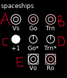
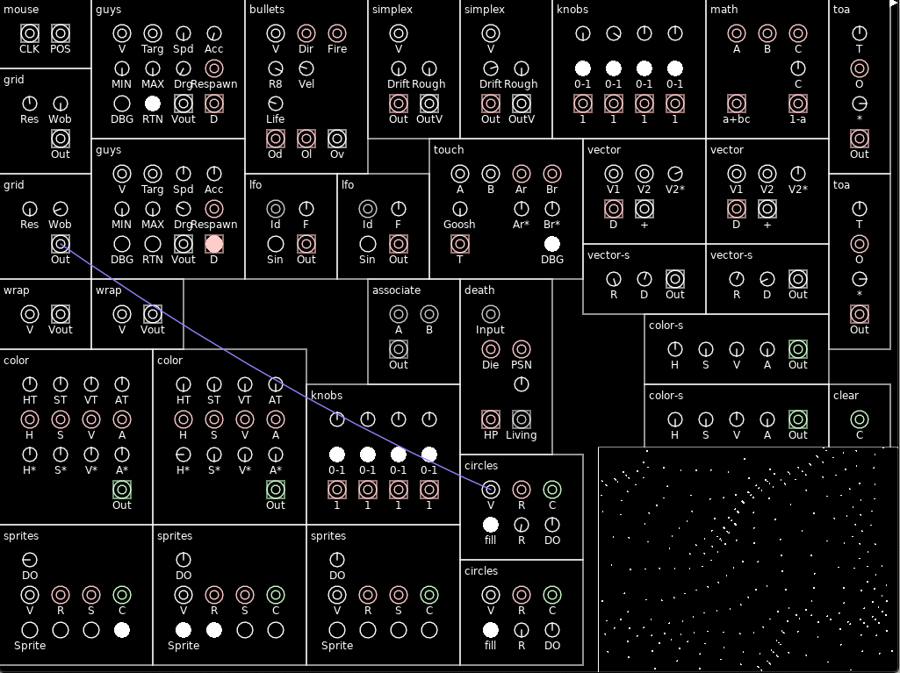
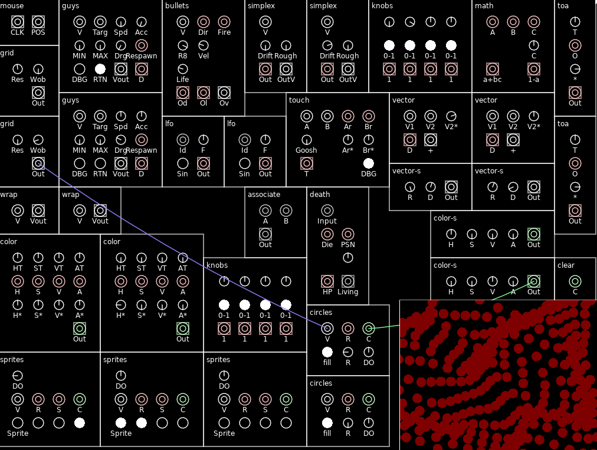
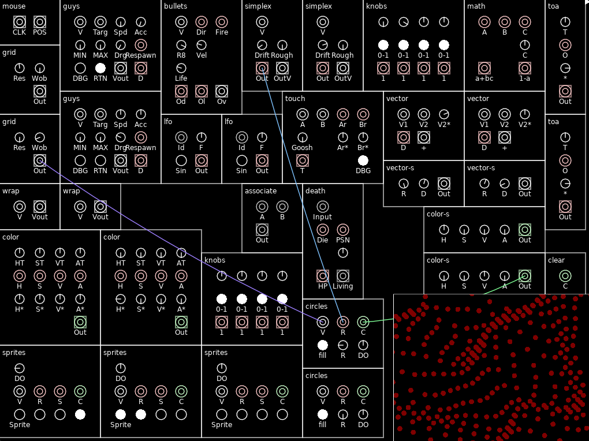
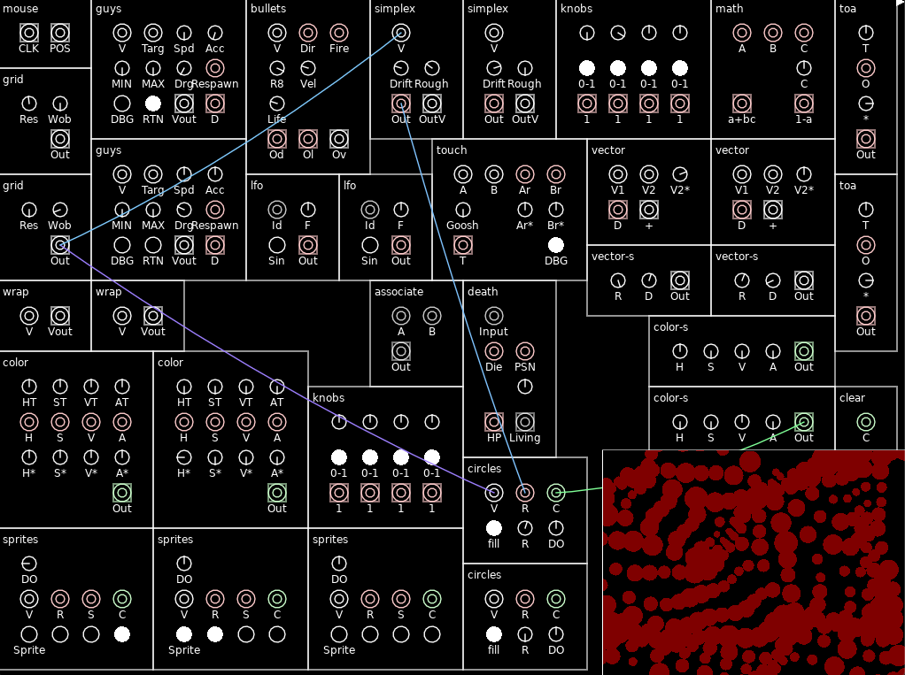

# mod_synth
Modular synth-inspired game engine, powered by löve2d.

# Tutorial

This is a proof of concept game engine, inspired by the design and mechanisms of modular synthesizers. Game behavior is determined by a rack of individual modules connected by wires. Your selection of modules and the way you patch them together determines how the game will behave.

When you launch the game you'll see a pre-configured rack of modules. By pressing the lowercase L key, followed by a number `1` through `6`, you can see some demo patches. Press `f` to expand the picture-in-picture view (lower right) to the full window and again to shrink it.

Modules have several types of inputs:

* Ports:
  * A, B, and E are all ports.
  * A and B are "input" ports. They receive data from another module.
  * E and the port next to it are "output" ports. They send data out of the module.
  * A and B are differently colored because they have different types. White (A) is for Vectors, Red (B) is for Numbers. Green (not pictured) is for color information, and Grey is for any type.
  * Input and output ports of compatible types can be connected to each other by dragging between them. An output port can be connected to multiple input ports, but not vice versa. (NOTE: currently an input can be connected to multiple outputs, but this is a bug.)
* Buttons (C) can be toggled on and off by clicking on them.
* Knobs (D) can be turned up and down by dragging left and right or by hovering hover them and scrolling.

Here's a simple example: Connect the output of the "grid" module (labelled with "OUT") to the vector input of the "circles" module (labelled with "V").

This will cause the "circles" module to draw a small circle at every position emitted by the "grid" module. Now let's tweak the "radius" knob of the circles module and connect the color (C) input of the circles module to the output of the nearby "color-s" module.

The circles become larger, and red. Play around with the knobs on color-s to see how the color changes.

Now let's connect the radius input (R) to the output of a "simplex" module. Make sure the "Drift" knob of the simplex module is turned up from zero. The radii of the circles will shift around according to the random flutuations of the simplex module. 

But it's not quite as cool as it could be, since every circle has the same radius. If we connect the simplex's input (V) to the grid's output (Out), then each individual grid point will receive its own random value, distributed spatially in the manner of simplex noise. NOTE: Make sure you drag from the simplex input to the grid's output, otherwise you'll pick up the existing cable connecting the grid output to the circles module. 

You can try moving the inputs from the `circles` module over to the `sprites` module to have it draw sprites instead of circles. When you transfer the "R" port, though, remember that for circles "R" stands for "radius", but in sprites it stands for "rotation". 

# Hotkeys

* `f`: Expands / contracts the picture-in-picture screen
* `space`: Pauses / resumes the simulation
* `S`: (Shift + s) Save the current patch to your current save slot
* `l0` -> `l9` (the first character is lowercase L) Load the patch stored in slot 0-9. The slot loaded becomes the current save slot and will be saved when you use `S`
* `s1` -> `s9` Saves the current patch to slot 0-9, does not set the current save slot.
* `cp` : Clears all the wires from the patch.
* `g`: Toggles "grab" mode on and off, allowing you to move modules around.
* `d`: Delete the next module you click on
* `a`: Prompts you to type in a module name, then adds that module

# Modules

### Bullets

Controller for shooting bullets from things

* V (Vector): Positions of shooters
* Dir (Number): Direction of each shooter. Bullets fired will travel in this direction.
* Fire (Number): When this has a >.5 value passing through it, the associated Vector will start firing bullets
* R8 (Knob): Rate of fire. Higher = bullets fire more frequently
* Vel (Knob): Velocity of bullets
* Life (Knob): How long the bullets remain before disappearing
* Od (Number output): Direction of each bullet
* Ol (Number output): Remaining life of each bullet
* Ov (Vector output): Position of each bullet

### Circles

Draws circles on screen.

* V (Vector): Positions of the circles
* R (Number): Radii of the circles
  * R (Knob): Attenuate Radius input
* C (Color): Color of the circles
* Fill (Button): On = circles are filled in Off = circles are outlines
* DO (Knob): Draw Order. Modules that draw things are drawn in order according to their Draw Order value.

### Clear

Sets the clear (background) color.

### Color

Creates colors dynamically. Uses Hue, Saturation, Value, and Alpha values are managed via 4 separate TOA arrays (see the [TOA](#TOA) module).

* Out (Color): The output color.

### Color-S

Simple color creator. Hue, Saturation, Value, and Alpha values are controlled via knobs.

### Death

Logical unit that controls life and death. Input values have a health amount and can be instantly killed or slowly poisoned. 

* Input (Any): Values of any type, each of which will be given a health value.
* Die (Number): Send a signal to this to kill the associated input
* PSN (Number): Send a signal to this to decrease the associated input's health over time. More input = more damage
  * Unnamed knob: Attenuates PSN input
* HP (Number out): How much HP the associated input has
* Living (Any output): For any living input, returns the same value as was passed in via the input. Dead values are not returned.

### Grid

Creates a grid of vectors

* Res: Knob that controls the resolution of the grid
* Wob: Controls the wobble of the grid: how uniform the points will be laid out
* Out: A vector at each point on the grid

### Guys

Controller for having little guys that run around. Each guy has a position and a target position, and tries to move towards the target position.

* V (*Vector*): Starting locations of each guy
* Targ (Vector): Target positions of each guy.
* Spd (Knob): Speed- How fast each guy moves
* Acc (Knob): Acceleration - How quickly each guy accelerates to his Speed
* MIN (Knob): Minimum distance - guys will not get closer than this distance to their target points.
* MAX (Knob): Maximum distance: If the target point is farther away than this, the guy won't continue following.
* Drg (Knob): Drag. How quickly guys decelerate when they're at their target position
* Respawn (Number): Send a signal to this send a guy back to his starting location.
* RTN (Button): If this is on, guys will return to their starting position if they loose track of their target.
* DBG (Button): Turn on debug info: draws information about where each guy is to the screen.
* VOut (Vector output): Positions of each guy
* D (Number output): Distance from each guy to his target.

### Knobs

A module for controlling fixed number values via knobs. Each Number output is controlled by the knob above it.

* <Unnamed knob> (Knob): Simple knob, its value is output on the `1` port below it.
* 0-1 (Button): If on, the output value is between 0 and 1. Otherwise, the value is between -1 and 1.
* 1 (Number output): The value of the knob above it.

### LFO

Low frequency oscillator, just like mama used to make

* ID (Any): Associates LFO values with arbitrary keys. If you want a bunch of different values to be out of phase based on when they're created, put an input into here.
* F (Knob): Frequency
* Sin (Button): Off = Sawtooth wave, On = Sine wave
* Out (Number output): Output value

### Math

For performing arithmetic on numbers

* A, B, C (Number): Input values. The default values for A, B, and C if no inputs are present are 0, 1, and 1 respectively.
* C (Knob): Attenuates the C port input.
* A+BC (Number output): Returns the result of `A+BC`
* 1-A (Number output): Returns in the inverse of the `A` input

### Mouse

Gets inputs from the mouse.

* CLK: Creates one vector wherever the mouse is clicked
* POS: A vector representing the current mouse position

### Simplex

Generate simplex noise

* V (Vector): Points from which to sample implex noise. Optional, as without vectors the module will generate one sample value.
* Drift (Knob): Simplex values animate over time. This knob controls how quickly they change.
* Rough (Knob): Roughness of random values. Lower values mean points nearer to each other will be more similar. Higher values mean nearby values will be more different.
* Out (Number output): Sampled random value as a number
* OutV (Vector output): Sampled random value as a vector

### Sprites

Draw sprites on screen. Which sprite to draw is determined by the array of button on the bottom. Each combination of on/off is a different sprite, making a total of 16 different sprites to draw. 

* DO (Knob): Draw order. Modules that draw things are drawn in order according to their Draw Order value.
* V (Vector): Where to draw the sprites
* R (Number): Rotation of the sprite
* S (Number): Scale of the sprite
* C (Color): Color of the sprite
* (Array of buttons): Used to specify which sprite to draw

### TOA

Stands for "Target, Offset, Attenuation." way of tweaking number values.

* T (Knob): The target output value. 
* O (Number): The offset value
* `*` (Knob): How much to attenuate the Offset value. Ranges from -1 to 1, where -1 inverts the Offset, 1 gives the full offset, and 0 makes the offset have no effect.
* Out (Number output): A mixture of T and O. The farther the attenuation value is from 0, the less effect T has on the output.

### Vector

Performs vector operations.

* V1 (Vector) : Vector 1
* V2 (Vector): Vector 2
* V2* (Knob): Vector 2 attenuation
* D (Number output): Distance from V1 to V2*A
* `+` (Vector output): V1 + V2*A

### Vector-S

Simple static vector creator.

* R (Knob): Rotation of output vector
* D (Knob): Distance of output vector
* Out (Vector out): Output vector

### Wrap

Wraps points around the screen

* V (Vector): Input vectors
* VOut (Vector output): Vector outputs, wrapped on the screen
